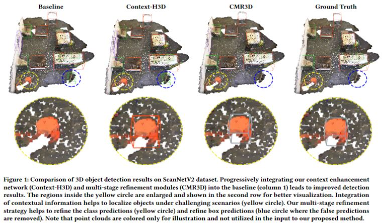

# CMR3D
Contextualized Multi-Stage Refinement for 3D Object Detection
This repository consists the implementation of our project [CMR3D] (https://arxiv.org/abs/2209.06641). This project aimed to understand and analyse the effectiveness of having contextual information in 3D Object Detection.

# Abstract

Existing deep learning-based 3D object detectors typically rely
on the appearance of individual objects and do not explicitly pay
attention to the rich contextual information of the scene. In this
work, we propose Contextualized Multi-Stage Refinement for 3D
Object Detection (CMR3D) framework, which takes a 3D scene
as an input and strives to explicitly integrate useful contextual
information of the scene at multiple levels to predict a set of object
bounding-boxes along with their corresponding semantic labels. To
this end, we propose to utilize a context enhancement network that
captures the contextual information at different levels of granularity
followed by a multi-stage refinement module to progressively refine
the box positions and class predictions. Extensive experiments on
the large-scale ScanNetV2 benchmark reveals the benefits of our
proposed method, leading to an absolute improvement of 2.0% over
the baseline. In addition to 3D object detection, we investigate the
effectiveness of our CMR3D framework for the problem of 3D object
counting. 



## Installation
It is advised to create a new conda environment for this project. The installation steps are as follows:
1. Create new conda environment and activate it.
```bash
$ conda create --name=cmr3d python=3.8
$ conda activate cmr3d
```
2. As this model uses PointNet++ Backbone similar to that of VoteNet, similar packages of votenet are required to install. The following dependencies need to be installed with ```pip install```

```
numpy
matplotlib
scipy
sklearn
opencv-python
plyfile
pytorch=1.1.0
tensorflow-gpu==1.12.0 (only for visualization)
'trimesh>=2.35.39,<2.35.40'
'networkx>=2.2,<2.3'
open3d
```

3. Compile the CUDA layers for PointNet++, which we used in the backbone network:

```
cd pointnet2
python setup.py install
```
4. 
